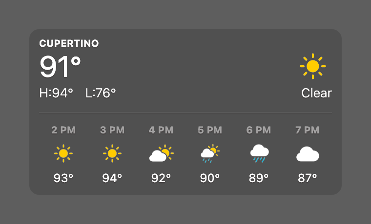
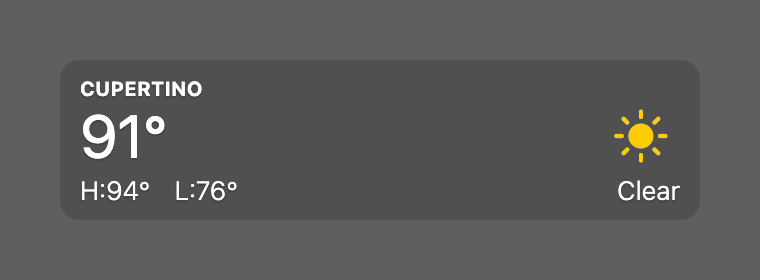
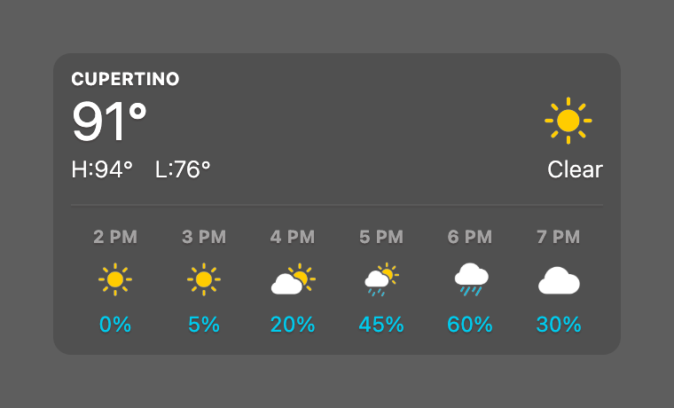
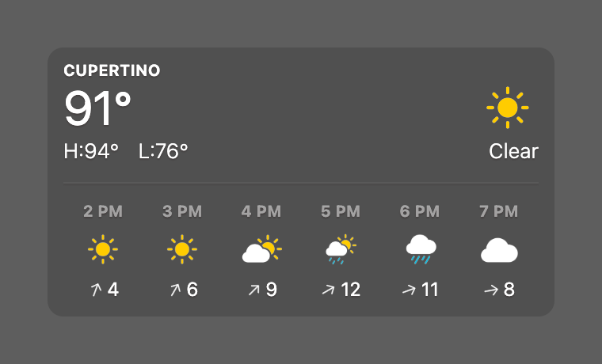

# Weather

[](https://creativecommons.org/licenses/by-nc/4.0/)

A weather widget for [Übersicht](http://tracesof.net/uebersicht/). It shows current conditions and temperature, the day's high/low, an hourly forecast strip that cycles through temperature, chance of precipitation, and wind, and active severe-weather alerts. Icons are macOS SF Symbols, rendered as two-layer masks so they carry Apple's accent colors while still flipping with your light/dark theme. Colors are theme-aware, with sensible built-in defaults, so the widget works on its own.

Weather comes from [Open-Meteo](https://open-meteo.com), alerts from the US [National Weather Service](https://www.weather.gov) (US only), and location from [ipinfo.io](https://ipinfo.io). No API keys are required.

## Screenshot



## Layouts

Set `layout` near the top of `index.coffee`:

| Value | Height | Shows |
|-------|--------|-------|
| `'hourly'` (default) | 170px | Everything, including the hourly strip below the divider |
| `'compact'` | 80px | The header block only: location, temperature, high/low, condition |



## Hourly strip

The bottom row of each hour cycles through three readings, cross-fading between them. Temperature holds longest, since it is the one you usually want; the other two are quicker looks on the way back round.

| Reading | Shown as | Default dwell |
|---------|----------|---------------|
| Temperature | `72°` | 15s |
| Chance of precipitation | `45%`, tinted in the same blue as the rain icons | 5s |
| Wind | `12` mph with an arrow pointing the way the wind is blowing | 5s |





The cycle pauses while your pointer is over the widget, so a reading does not swap away mid-glance. Any reading the forecast does not include is skipped.

## Options

All near the top of `index.coffee`:

| Option | Default | What it does |
|--------|---------|--------------|
| `widgetEnabled` | `true` | Set `false` to hide the widget without uninstalling it |
| `layout` | `'hourly'` | `'hourly'` or `'compact'` (see above) |
| `hourlyMetrics` | `['temp', 'precip', 'wind']` | Which readings the strip cycles, and in what order. A single entry pins that reading and never cycles |
| `hourlyDwellSeconds` | `temp: 15, precip: 5, wind: 5` | How long each reading holds |
| `hourlyFadeSeconds` | `1.2` | Length of the cross-fade between readings. `0` swaps instantly |
| `refreshFrequency` | `900000` | How often the forecast is fetched, in milliseconds (15 minutes) |

## Alerts

When the National Weather Service has an active alert for your location, it appears at the top right, colored by severity. Click it to open the NWS point-forecast page for your coordinates, whose Hazards section links the full text of every active alert.

## Icons: generated on first run (not shipped)

This widget does **not** include any icon image files. Apple's SF Symbols license does not permit redistributing the symbols as exported artwork, so instead the widget renders them **locally on your own machine**, from the SF Symbols already built into macOS.

How it works:

- `lib/render-symbols.swift` renders each weather symbol into two PNGs in `lib/icons/`:
  - `<name>.ink.png` — the full white silhouette, used as a CSS mask tinted by your theme's text color (so it flips light/dark).
  - `<name>.color.png` — just the saturated accent pixels (sun yellow, rain blue), overlaid on the ink layer.
- `lib/weather.sh` checks for the icons on each run and, if they're missing, runs the Swift renderer once to generate them (about 2 seconds). After that the cached PNGs are reused. They also regenerate automatically if you ever delete the `lib/icons/` folder.

The generated `lib/icons/` folder is git-ignored so it is never committed or redistributed.

## Requirements

- **Xcode Command Line Tools.** Icon generation uses Swift. If the tools aren't installed, `swift` isn't available, the icons can't render, and the widget shows text without icons. Install them with:

  ```
  xcode-select --install
  ```

- **macOS with SF Symbols** (macOS 11 Big Sur or later). The symbols are read from the system, so nothing needs to be downloaded.

- No special macOS privacy permissions are needed. The renderer only reads built-in system symbols and writes PNGs into the widget's own `lib/icons/` folder; the data script only makes outbound `curl` requests. If macOS ever blocks the Swift step, allow it under **System Settings > Privacy & Security > Open Anyway**, then refresh Übersicht.

## Location

Location is auto-detected from your public IP via ipinfo.io. To pin it (or if detection is wrong), set `LAT`, `LON`, and `CITY` near the top of `lib/weather.sh`:

```bash
LAT="37.3230"
LON="-122.0322"
CITY="Cupertino"
```

## Installation

- Download the [repository](https://github.com/dionmunk/uebersicht-weather/archive/master.zip) and extract it.
- Place the `weather.widget` folder in your Übersicht extension folder.
- Refresh Übersicht (the first refresh generates the icons).

## Theming

This widget is theme-aware. Its colors come from CSS custom properties (text, panel tint, status and series colors) with sensible built-in fallbacks, so it looks right on its own. Install the [Theme Controller](https://github.com/dionmunk/uebersicht-theme-controller) widget and this one automatically follows its color scheme and light/dark mode, staying in sync with the rest of the collection.

## License

This work is licensed under a [Creative Commons Attribution-NonCommercial 4.0 International License](https://creativecommons.org/licenses/by-nc/4.0/). This applies to the widget's own code; it does not grant any rights to Apple's SF Symbols, which remain subject to Apple's license and are never redistributed here.
